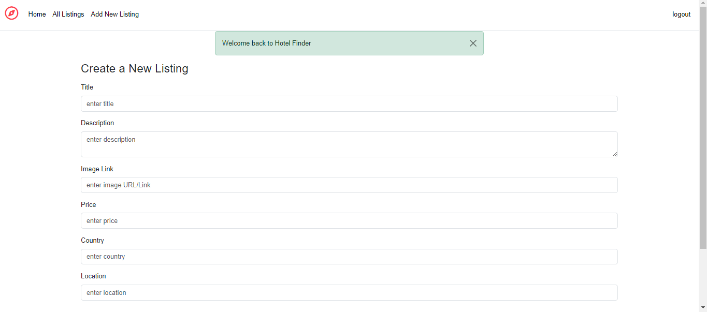
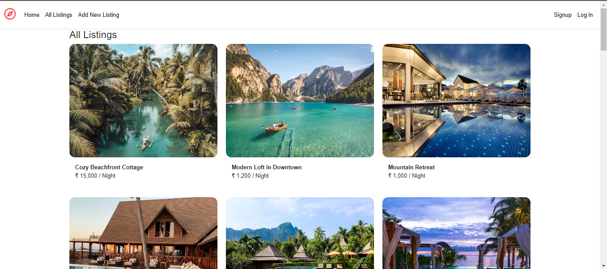
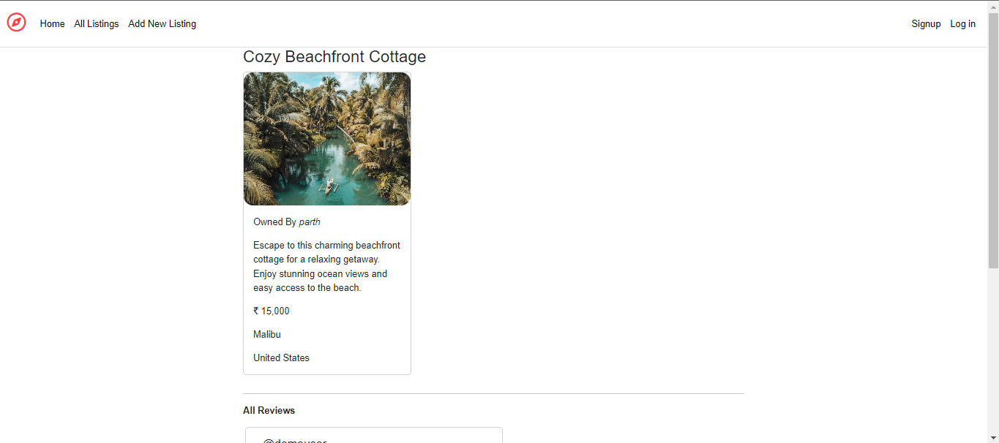
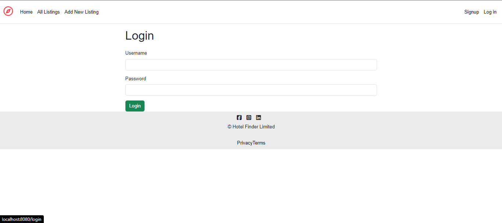
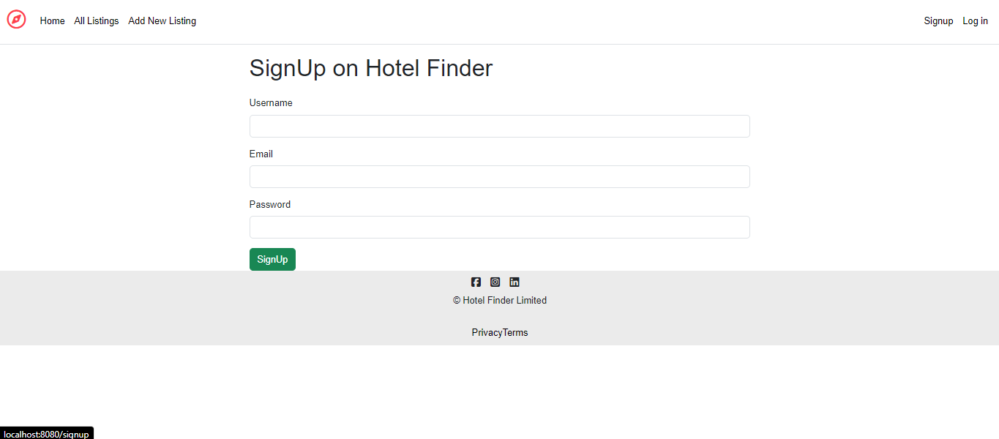

# Hotel Finder Website

## Overview

The Hotel Finder Website is a web application developed using the MERN stack (MongoDB, Express.js, React, Node.js) that allows users to search for hotels, view details, and book rooms. The application provides a seamless user experience with features such as hotel listings, user authentication, and booking management.
## Features

1. **Hotel Listing:**
   - Users can browse a list of hotels, each with detailed information such as location, amenities, pricing, and ratings.

2. **User Authentication:**
   - Users can create an account, log in.

## Prerequisites

- Node.js
- MongoDB
- React
- Express.js

1. Open the project in Visual Studio Code
2. Run Npm install
3. Run cd init
4. Run nodemon index.js
5. This Step initializes the database
6. Run nodemon app.js
7. Open Browser and enter http://localhost:8080/listings

## Screenshots

## Feedback

I welcome your feedback! If you encounter any issues or have suggestions for improvement, please feel free to create an issue or reach out to the project me at samudraparth1@gmail.com.

Happy Coding!
